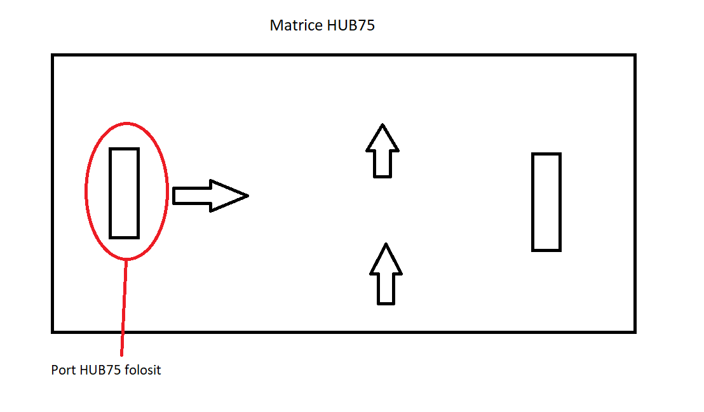

# Matrix Display (ESP32 + RS485 + HUB75)

This project reads data from a FATEK PLC over Modbus RTU (RS485) and shows status messages on a HUB75 LED matrix panel.

The firmware runs on ESP32 and uses two FreeRTOS tasks:
- one task for Modbus communication;
- one task for LED matrix rendering.

## What This Application Does

- Reads PLC coils and registers (`M`, `D`, `R`) through Modbus RTU.
- Converts selected register ranges into text.
- Chooses a display scenario based on PLC state.
- Shows 3-line messages with centered text and smooth scrolling.
- Detects PLC communication timeout and shows error status.

## Scenario Priority and Hierarchy

The firmware always shows only one active scenario, based on this priority order (top = highest priority):

1. **Scenario 6 - Communication error**  
   Condition: Modbus communication timeout.  
   Display: `Acest post este INDISPONIBIL E0`

2. **Scenario 7 - Unavailable**  
   Condition: `M120 = 0` (only when communication is OK).  
   Display: `Acest post este INDISPONIBIL E1`

3. **Scenario 5 - Pause finished**  
   Condition: `M99 = 1` and `D0 > 0`.

4. **Scenario 4 - Pause**  
   Condition: `M97 = 1` and `D0 > 0`.

5. **Scenario 3 - Function display**  
   Condition: `M94 = 1`, exactly one of `M71..M79 = 1`, and `D0 > 0`.

6. **Scenario 1 / 1.1 / 1.2 - Welcome states** (`D0 = 0`)  
   - Scenario 1: `M320 = 1`  
   - Scenario 1.1: `M322 = 1`  
   - Scenario 1.2: `M321 = 1`  
   Internal text selection order in code: `1.2` -> `1.1` -> `1`.

7. **Scenario 2 - Amount introduced**  
   Condition: `D0 > 0` (used when higher-priority scenarios are not active).

Some lines are static and some lines scroll from right to left, based on scenario and text length.

## FATEK Registers Used and Where They Are Used

### M Coils (Discrete Relays)

- `M71..M79` (`0x817..0x81F`): select active function group in Scenario 3 (exactly one active).
- `M94` (`0x82E`): enables Scenario 3 logic.
- `M97` (`0x831`): enables Scenario 4 (Pause).
- `M99` (`0x833`): enables Scenario 5 (Pause finished).
- `M120` (`0x848`): availability flag (`0` -> Scenario 7 unavailable message).
- `M320` (`0x910`): Scenario 1 (welcome + minimum amount).
- `M321` (`0x911`): Scenario 1.2 (welcome variant with Boxa + ATM message).
- `M322` (`0x912`): Scenario 1.1 (welcome variant with tokens message).

### D Registers (Data Registers)

- `D0` (`0x1770`): core amount/status condition (`D0 = 0` for welcome states, `D0 > 0` for amount-based states).
- `D10` (`0x177A`): used in Scenario 1 to build `minim X Lei/Leu`.
- `D47..D49` (`0x179F..0x17A1`): time/value formatting for Scenario 3 and Scenario 5.
- `D57..D59` (`0x17A9..0x17AB`): time/value formatting for Scenario 4.

### R Registers (Holding Registers)

- Used ranges: `R10..R99` (`0x0A..0x63`) and `R110..R199` (`0x6E..0xC7`).
- These registers hold ASCII text payload for Scenario 3.
- Mapping by active `M` bit:
  - `M71` -> line 1 from `R10..R19`, line 2 from `R110..R119`
  - `M72` -> line 1 from `R20..R29`, line 2 from `R120..R129`
  - `M73` -> line 1 from `R30..R39`, line 2 from `R130..R139`
  - `M74` -> line 1 from `R40..R49`, line 2 from `R140..R149`
  - `M75` -> line 1 from `R50..R59`, line 2 from `R150..R159`
  - `M76` -> line 1 from `R60..R69`, line 2 from `R160..R169`
  - `M77` -> line 1 from `R70..R79`, line 2 from `R170..R179`
  - `M78` -> line 1 from `R80..R89`, line 2 from `R180..R189`
  - `M79` -> line 1 from `R90..R99`, line 2 from `R190..R199`

## Colors Used

The display uses RGB colors from code (via `color565` conversion):

- White: `(255, 255, 255)` for welcome messages (Scenarios 1/1.1/1.2)
- Light green: `(128, 255, 128)` for Scenario 2
- Red: `(255, 0, 0)` for Scenarios 6 and 7
- Orange: `(255, 128, 0)` for Scenario 4 title
- Pink: `(255, 128, 128)` for Scenario 5 title lines
- Blue accent: `(128, 128, 255)` for time lines in Scenarios 3/4/5

Scenario 3 line colors by function bit:
- `M71`: `(0, 255, 128)`
- `M72`: `(0, 128, 255)`
- `M73`: `(255, 0, 255)`
- `M74`: `(0, 255, 255)`
- `M75`: `(128, 255, 0)`
- `M76`: `(255, 0, 128)`
- `M77`: `(128, 0, 255)`
- `M78`: `(0, 255, 0)`
- `M79`: `(255, 255, 0)`

## Hardware and Communication

- MCU: ESP32
- PLC link: RS485 (Modbus RTU)
- Matrix: HUB75, configured as `64x32`, chain `1`
- HUB75 to ESP32 pin mapping used in this project:
  - `R1` -> `GPIO25`
  - `G1` -> `GPIO26`
  - `B1` -> `GPIO27`
  - `R2` -> `GPIO14`
  - `G2` -> `GPIO12`
  - `B2` -> `GPIO13`
  - `A`  -> `GPIO23`
  - `B`  -> `GPIO19`
  - `C`  -> `GPIO18`
  - `D`  -> `GPIO5`
  - `E`  -> `-1` (not used for current panel setup)
  - `LAT` -> `GPIO32`
  - `OE`  -> `GPIO15`
  - `CLK` -> `GPIO33`
- Modbus serial defaults in code:
  - RX: `16`
  - TX: `17`
  - RE/DE: `4`
  - Baud: `115200`
  - Slave ID: `1`

For deeper technical details about FATEK register maps, address models, and protocol-level behavior, please consult the official FATEK manuals.

## Project Structure

- `main/main.ino` - main firmware, display scenarios, task creation.
- `main/FATEKModbus.h` - Modbus data structures and API.
- `main/FATEKModbus.cpp` - Modbus polling, parsing, error handling, communication state.

## Wiring and Reference Images

### HUB75 Connector

### ESP32 Pinout (NODE32S)

### ESP32 Dev Board 10 Pinout

### HUB75 Port Orientation Used

## Dependencies

This project uses:
- [`ESP32-HUB75-MatrixPanel-I2S-DMA`](https://github.com/mrcodetastic/ESP32-HUB75-MatrixPanel-DMA) (HUB75 library)
- [`eModbus`](https://github.com/eModbus/eModbus) (Modbus RTU client on ESP32)
- [`Arduino Core for ESP32`](https://github.com/espressif/arduino-esp32) (Arduino core/framework components)

## License

This repository is licensed under **GNU General Public License v3.0 (GPL-3.0)**.

See the full license text in the `LICENSE` file.

## Third-Party License Notes and Credits

This project includes or depends on third-party software with permissive/compatible licenses:

- **HUB75 library** (`ESP32-HUB75-MatrixPanel-I2S-DMA`) - MIT License - [GitHub](https://github.com/mrcodetastic/ESP32-HUB75-MatrixPanel-DMA)
- **eModbus** - MIT License - [GitHub](https://github.com/eModbus/eModbus)
- **Arduino core/framework parts** - LGPL-compatible usage - [GitHub](https://github.com/espressif/arduino-esp32)

Compatibility note:
- MIT-licensed code is compatible with GPL-3.0 and can be used in a larger GPL project.
- Arduino LGPL components are also compatible with this use model.

Important obligations kept by this project:
- Original copyright/license notices from MIT dependencies must be preserved.
- Third-party license terms remain valid for their own code parts.
- This project-level license (GPL-3.0) applies to the project as distributed.

If you redistribute this project, keep this `README.md`, the `LICENSE` file, and all required third-party attribution/license notices.

